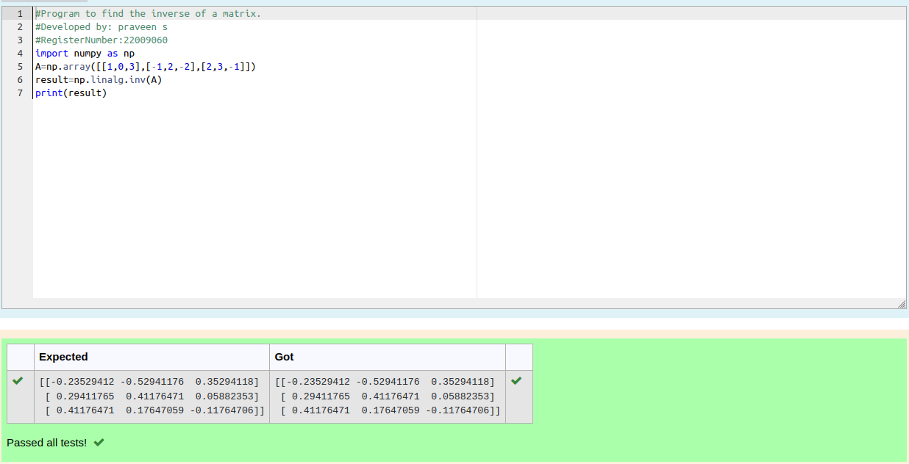

# INVERSE-OF-A-MATRIX

## Aim:

To write a python program to find the inverse of a matrix

## Equipment’s required:

1. 	Hardware – PCs
2. 	Anaconda – Python 3.7 Installation / Moodle-Code Runner

## Algorithm:

### Step1 :
Iport the numpy module to use built-in funclion for calculation 
### Step 2: 
Prepare the list from matrix's each row and assign in np.array()
### Step 3:
Using the np.linalg .inv(), we can find the inverse of the given matrix
### Step 4: 
End the program

## Program:
```
#Program to find the inverse of a matrix.
#Developed by: praveen s
#RegisterNumber:22009060
import numpy as np
A=np.array([[1,0,3],[-1,2,-2],[2,3,-1]])
result=np.linalg.inv(A)
print(result)
```
## Output:

## Result:

Thus the inverse of given matrix is successfully solved using python program

